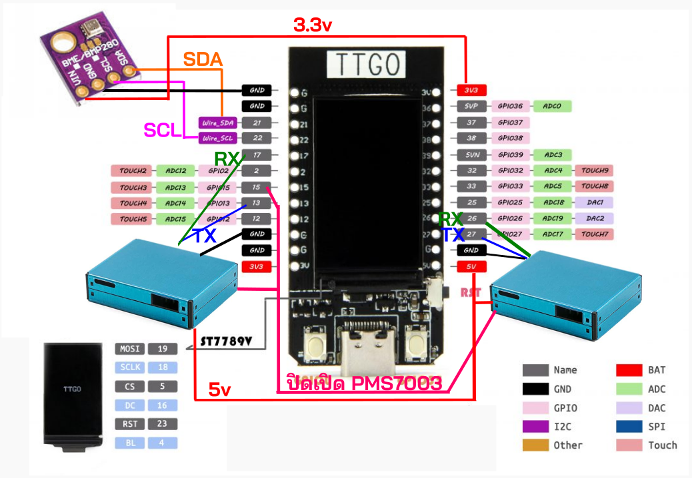

# PamaSense
Thai developer please reade [README_th.md](./README_th.md) instead

Self-developed dust meter, during the time I was a tutor at Traiphat High School around 1976-1979, it was a time when I was aware of PM2.5 dust that affected students.
There were many models developed, the last model had a color screen, could be connected to a battery for portability, supported deep sleep to save power, and had two dust sensors installed for two years before being removed because one of the sensors had a problem, and no one continued the Mibile App project that was used together. There was quite a lot of work in the front, so it was not developed further after that.
I put the code on Github in case it would be useful for those who are interested in studying.

## Feature
- PM2.5 dust sensor, two units average, temperature, humidity, air pressure
- Screen turns off by itself to reduce power consumption and extend screen life
- Change Wifi without changing Firmware, use ESPTouch (SmartConfig)
- Extend the life of various devices (PMS7003 lasts for 2-3 years from the original 1 year) Sensors turn on and off according to time, turn off backlight when not in use, use deepsleep, can wake up by pressing a button
- Work offline when portable
- Can bring the measured values ​​to [Thingspeak](https://thingspeak.mathworks.com/)
- Can bring the measured values ​​to PaMaSmell, a mobile app developed by parents in the school to collect PM2.5 values ​​from volunteers, devices, and data from many sources to display on the mobile phone
- Can install a 3.7v Litiumion battery, suitable for carrying, the board can be charged by itself. Normally, it is not installed because it is a station where the school has power all the time.

## Hardware
- TTGO T-Display: ESP32 has a color screen, can turn off the balacklight TFT_BL(4)
- BME280 sensor measures temperature, humidity, air pressure, communicates via I2C I2C_SDA(21),I2C_SCL(22)
- PMS7003x2 measures dust values, communicates via Serial1/2, RX_A(17),TX_A(13),RX_B(26),TX_B(27),WAKE_PIN(15)
- Battery 3.7v: makes it portable

## Setup
- Install Library for T-Display(TFT_eSPI) from [this website.](https://www.youtube.com/watch?v=b8254--ibmM)
- Install required libraries Button2, PMS Library, Adafruit BME280
- Mobile install [ESP Config](https://play.google.com/store/apps/details?id=com.techbot.smart_config) for setting up Wifi

## Note
- The original code is updated until early 2021. Before going to Git (early 2025), you have to add one line (#include "esp_mac.h") to compile. - ESP Touch is no longer available in the Play Store. Use [ESP Config].(https://play.google.com/store/apps/details?id=com.techbot.smart_config) 
- I've wanted to install GPS but haven't done it yet. - Now I'm trying to use ESPHOME to measure dust in my house. It has fewer functions, but the advantage is that I don't have to write code. I can easily control and send values ​​to Home Assistant or MQTT. It's easier to use the data.

