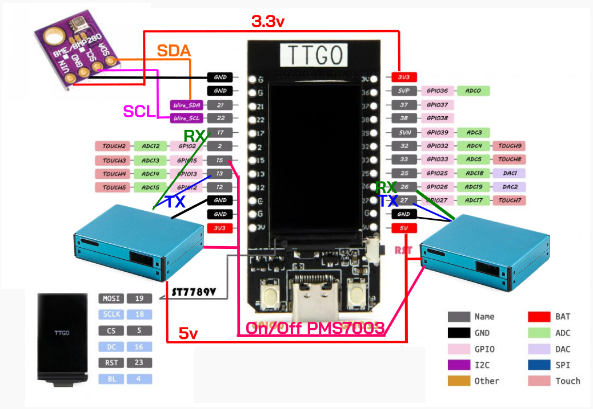

# PamaSense
English developer please reade [README.md](./README.md) instead

เครื่องวัดฝุ่นแบบพัฒนาขึ้นมาเอง สมัยสอนพิเศษที่โรงเรียนมัธยมไตรพัฒน์ประมาณช่วงปี ค.ศ. 2519-2522 เป็นช่วงที่ตื่นตัวกับฝุ่น PM2.5 ที่มีผลกับนักเรียน
มีการพัฒนาออกมาหลายรุ่น รุ่นสุดท้ายมีหน้าจอสีสามารถต่อแบตเตอรี่เพื่อพกพาได้ รองรับ deep sleep เพื่อประหยัดไฟ แล้วมีเซนเซอร์วัดฝุ่นสองตัว ติดตั้งไว้สองปีก่อนถอดออกเพราะเซนเซอร์ตัวหนึ่งมีปัญหา และโปรเจ็ก Mibile App ที่ใช้ร่วมกันไม่มีคนทำต่อ งานในหน้าที่ค่อนข้างมาก เลยไม่ได้พัฒนาต่อหลังจากนั้น
ผมเอาโค้ดขึ้น Github ไว้เผื่อเป็นประโยชน์กับคนที่สนใจศึกษา 

## Feature
- เซนเซอร์วัดค่าฝุ่น PM2.5 มีสองตัวเอามาเฉลี่ยกัน, วัดค่า อุณหภูมิ, ความชื้น, ความกดอากาศ
- หน้าจอดับเองเพื่อลดการใช้พลังงานและยืดอายุหน้าจอ
- เปลี่ยน Wifi โดยไม่ต้องเปลี่ยน Firmware ใช้ ESPTouch (SmartConfig)
- ยืดอายุการใช้งานอุปกรณ์ต่างๆ(PMS7003 อยู่ได้ 2-3ปี จากเดิม1ปี) เซนเซอร์เปิดปิดตามเวลา, ปิด backligh ตอนไม่ใช้งาน, ใช้ deepsleep สามารถปลุดให้ตื่นได้ด้วยกดปุ่ม
- ทำงานแบบ Offline ได้กรณีพกพา
- สามารถนำค่าที่วัดขึ้น [Thingspeak](https://thingspeak.mathworks.com/)
- สามารถนำค่าที่วัดขึ้น PaMaSmell ซึ่งเป็นแอปสำหรับมือถือที่ผู้ปกครองในโรงเรียนพัฒนาขึ้นมาไว้รวบรวมค่า PM2.5 จากอาสาสมัคร อุปกรณ์ และข้อมูลจากหลายที่มาแสดงบนมือถือ
- สามารถติดตั้ง Battery Litiumion 3.7v เหมาะสำหรับพกพา บอร์ดสามารถชาร์ดได้ในตัว ปกติจะไม่ได้ติดตั้งไว้ เพราะเป็นสถานีที่โรงเรียนมีไฟต่อตลอด

## Hardware
- TTGO T-Display: ESP32 มีหน้าจอสี ปิด balacklight ได้ TFT_BL(4)
- BME280 เซนเซอร์วัด อุณหภูมิ ความชื้้น ความกดอากาศสื่อสารผ่าน I2C I2C_SDA(21),I2C_SCL(22)
- PMS7003x2 วัดค่าฝุ่นสื่อสารผ่าน Serial1/2, RX_A(17),TX_A(13),RX_B(26),TX_B(27),WAKE_PIN(15)
- Battery 3.7v: ทำให้สามารถพกพาได้

## Setup
- ติดตั้ง Library สำหรับ T-Display(TFT_eSPI)  [ตามเวปนี้](https://www.youtube.com/watch?v=b8254--ibmM)
- ติดตั้ง Library ที่จำเป็น Button2, PMS Library, Adafruit BME280
- มือถือติดตั้ง [ESP Config](https://play.google.com/store/apps/details?id=com.techbot.smart_config) เพื่อตั้งค่า Wifi

## Note
 - โค้ดเดิมอัปเดตจนถึงต้นปีค.ศ. 2021 ก่อนขึ้น Git (ต้นปีค.ศ. 2025)ต้องเพิ่มหนึ่งบรรทัด(#include "esp_mac.h") เพื่อให้คอมไพล์ผ่าน
 - ESP Touch ไม่มีใน Play Store แล้วให้ใช้ [ESP Config](https://play.google.com/store/apps/details?id=com.techbot.smart_config) แทน
 - เคยอยากติด GPS ด้วยแต่ก็ยังไม่ได้ทำซักที
 - ตอนนี้ลองใช้ ESPHOME ทำเครื่องวัดฝุ่นในบ้าน ฟังก์ชั่นน้อยกว่า แต่ข้อดีคือไม่ต้องเขียวนเขียนโค้ดเลย สามารถควบคุมและส่งค่าไป Home Assistant หรือ MQTT ได้ง่าย นำข้อมูลไปใช้งานต่อได้ง่ายกว่า

